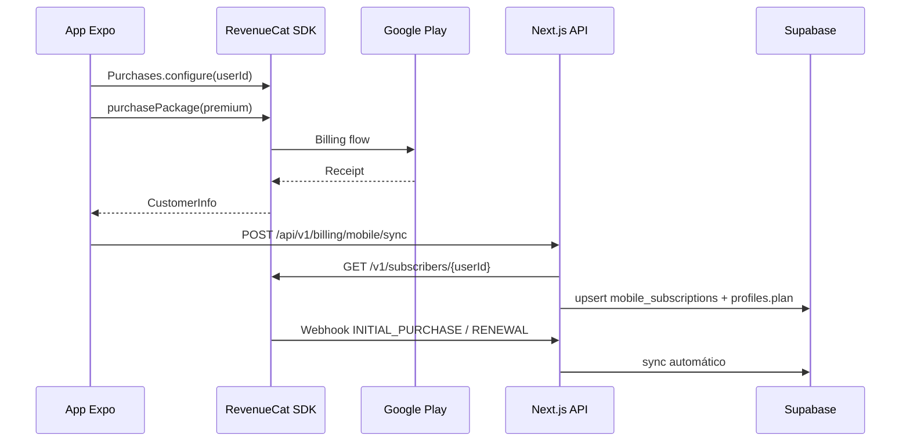

# Billing mobile — RevenueCat + Google Play

Assinaturas do app **Chefe da Casa** (Expo/React Native) via RevenueCat, sincronizadas com Supabase (`profiles.plan` + `mobile_subscriptions`).

## Arquitetura



## Planos

| App (UX) | Entitlement RevenueCat | Tier Supabase | Limites      |
| -------- | ---------------------- | ------------- | ------------ |
| Gratuito | —                      | FREE          | `plans.free` |
| Premium  | `premium`              | PRO           | `plans.pro`  |

Definição UX: `src/config/mobile-plans.ts`. Limites enforced: `src/lib/billing/plan-limits.ts`.

## Variáveis

### Backend (`.env`)

```bash
REVENUECAT_SECRET_KEY=sk_...
REVENUECAT_WEBHOOK_SECRET=...
REVENUECAT_ENTITLEMENT_PREMIUM=premium
SUPABASE_SERVICE_ROLE_KEY=...
```

### App (`apps/mobile/.env`)

```bash
EXPO_PUBLIC_SUPABASE_URL=
EXPO_PUBLIC_SUPABASE_ANON_KEY=
EXPO_PUBLIC_API_URL=https://seu-dominio.com
EXPO_PUBLIC_REVENUECAT_ANDROID_API_KEY=goog_...
```

## Endpoints

| Método | Rota                            | Descrição                          |
| ------ | ------------------------------- | ---------------------------------- |
| GET    | `/api/v1/billing/mobile/status` | Plano, limites e assinatura mobile |
| POST   | `/api/v1/billing/mobile/sync`   | Sincroniza após compra/restauração |
| POST   | `/api/webhooks/revenuecat`      | Webhook RevenueCat (Bearer secret) |

## Configurar RevenueCat

1. Criar projeto **Chefe da Casa**
2. Conectar **Google Play** (service account + package name)
3. Criar entitlement `premium`
4. Offering `default` com package `chefe_premium_monthly` (trial 7 dias no Play Console)
5. Webhook → `https://SEU-DOMINIO/api/webhooks/revenuecat` com Authorization Bearer = `REVENUECAT_WEBHOOK_SECRET`
6. Eventos: INITIAL_PURCHASE, RENEWAL, CANCELLATION, EXPIRATION, BILLING_ISSUE, etc.

## App mobile

```bash
cd apps/mobile
cp .env.example .env
npm install
npx expo prebuild   # necessário para react-native-purchases
npx expo run:android
```

## Coexistência com Stripe (web)

Usuários podem assinar na web (Stripe) ou no app (Google Play). O tier efetivo é o **maior** entre assinatura Stripe ativa e entitlement mobile (`maxPlanTier`).

## Testes

- Google Play: licenças de teste + conta testador
- RevenueCat: Sandbox / Test Store
- Restaurar compras: botão na paywall → `restorePurchases` + `POST /billing/mobile/sync`
